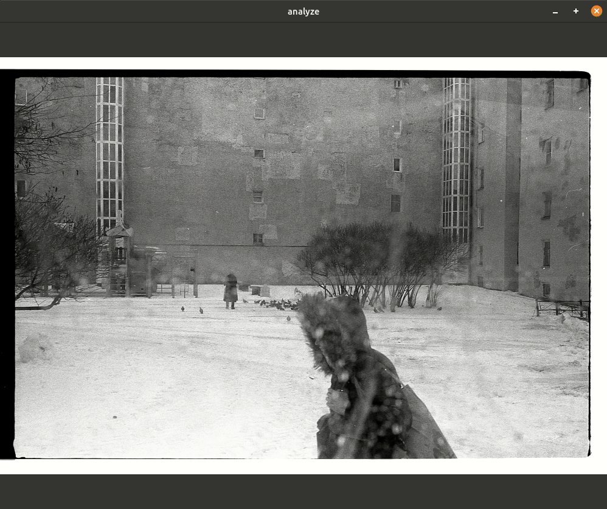
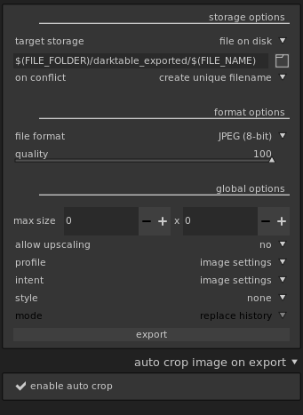

# cropneg
## Description
cropneg is a [darktable](https://www.darktable.org/) plugin that automatically crops negative scans by exposed area bounds.
Main application is written in go using [GoCV](https://github.com/hybridgroup/gocv) library.
 
This project was inspired by [this](https://gist.github.com/stecman/91cb5d28d330550a1dc56fa29215cb85) proof of concept.

### How it works
Application tries to find exposure bounds of provided image by gradually thresholding it.

Cropping works best if your scan has good contrast between exposed area and film base.

---
### Installation
[Download](https://github.com/danilkhromov/cropneg/releases) the archive, place `cropneg` binary in your `$HOME/bin` folder. 
Place the `crop_negative.lua` in the `$HOME/.config/darktable/lua` and then add `require "crop_negative"` to the `luarc` file in `$HOME/.config/darktable`.

For more information about the lua scripts for darktable see [this](https://github.com/darktable-org/lua-scripts#enabling) 
and [this](https://www.darktable.org/usermanual/en/lua_chapter.html).

### Usage
In darktable select `enable auto crop` checkbox located under the export tab. Selected images will be cropped 
automatically in the export process.

 

---
#### Notes
Currently this application can run on linux.
